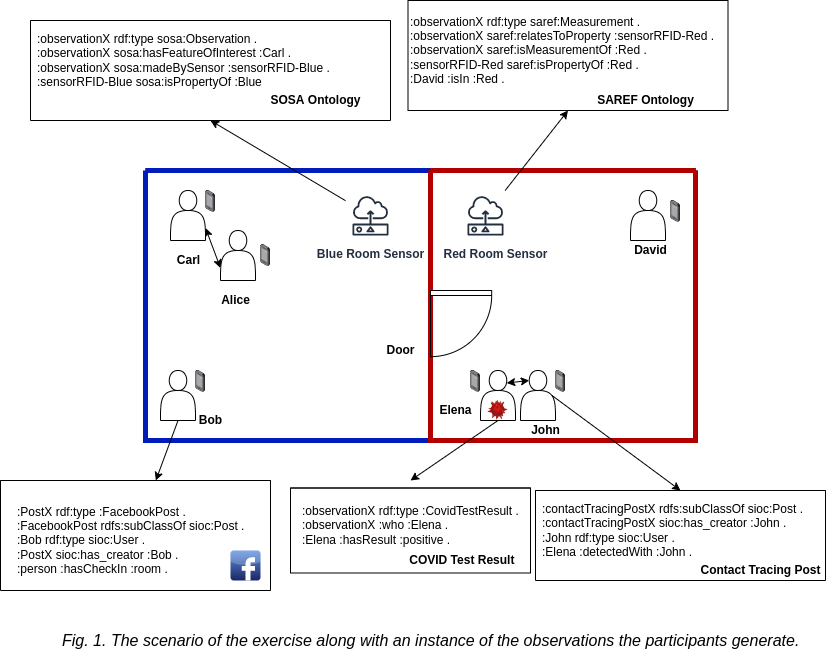

# Roxi Tutorial

This repository contains a version of the RSP4J Tutorial, with [Roxi](https://github.com/pbonte/roxi) (by [Pieter Bonte](https://pbonte.github.io/))

We will use a covid scenario consisting of two-room (BlueRoom and RedRoom) and 4 types of streams:

- RFID observations that report the location of a person through RFID tags.
- Facebook check-in posts that also report the location of a person.
- Contact tracing posts that report the presence of two individuals together.
- Testing results posts that report the results of a corona test a certain individual took.
- Both rooms blue and red publish the observation events with different ontologies, i.e SOSA and SAREF respectively.

The individuals in each room will be moving around from one room to the other.

## Context

The standard setup of the COVID scenario,



## How to Start?

Make sure to install [NodeJS](https://nodejs.org/en/), npm and git if not installed already.

Clone the repository from [here](https://github.com/argahsuknesib/Roxi-Tutorial)

```
git clone https://github.com/argahsuknesib/Roxi-Tutorial
cd Roxi-Tutorial
npm install
cd src
```

In `src/` folder we will have,

```
src
|- utils/
|- index.js
|- query.rq
|- rules.n3
|- abox.n3
```

### Description of the files.

- index.js consists of the roxi engine, where you can define the width and size of the window as well as the number of observations to be generated from the streams. It uses the query, rules and abox files.
- query.rq is where you will write the queries for the tasks specified later [here](#tasks).
- rules.n3 is where you will write the rules.
- abox.n3 consists of the static assertion components. They do not change per generated event and thus are not included in the events. In our context, the location of sensors in red room and in blue room are constant. It makes sense to store them in the abox than send them along with every event. So, we have added this information in the abox.n3 file.

```
:sensorRFID-Blue sosa:hasLocation :Blue
:sensorRFID-Red saref:isPropertyOf :Red
```

## Tasks

### Task 1: Finding out the location of a person.

The location of the person is updated by both the Facebook Check-In Post stream and the RFID sensors of the two rooms. The sample observation generated from them is demonstrated in the figure of section [context](#context).

As you can see in the events generated by the RFID sensor in the Blue room which uses SOSA ontology, but `:isIn` relation is not specified directly.

A sample SOSA ontology observation from the blue room.

```
:observationX rdf:type sosa:Observation .
:observationX sosa:hasFeatureofInterest :Carl .
:observationX sosa:madeBySensor :sensorRFID-Blue .
:sensorRFID-Blue sosa:hasLocation :Blue .
```

- Write a rule in `src/rules.n3` for inferring the `?person :isIn ?room` relation.

Now you can find the location of the person who was reported with RFID sensor observation with the following query.

```
select ?person ?room where {
    ?person :isIn ?room
}
```

Similarly, to find the location of the person who was reported with Facebook Check-In posts, the following query can be written.

```
select ?person ?room where {
    ?person :hasCheckIn ?room
}
```

We can see that both RFID and Facebook Post do the localisation of the person, so it makes sense to align them to get the location property.

- Open the `src/rules.n3` file, and write a rule to align the location update from the Facebook check-in posts (:hasCheckIn) to the location updates from the RFID sensor (:isIn) . This will allow us to query both the location updates in the same way at the same time.

Once the rules have been aligned, re-run the program with:

```
npm run start
```

to get the location of the person.

Note that it could take a few seconds before seeing results.

### Task 2: Finding out if the person is positive and is in which room.

In the previous exercise, we found out the location of the person.
The covid test result event describes which person is COVID positive. An example observation of the COVID test result stream is,

```
:observationX rdf:type :CovidTestResult .
:observationX :who :Elena .
:Elena :hasResult :positive .
```

- Write a query to find out the COVID-positive person (?person) and his location (?room) by adding and using the `:hasResult` property to check the person is COVID-positive.

Once the query is written, re-run the program with

```
npm run start
```

The result will be the location of the person who has a positive COVID result.

### Task 3: Finding if there's a contact traced person at risk of COVID with a COVID-positive person.

In the previous exercises,

We were able to combine streams of observations to find out the positive COVID person and their location.

We also have a stream for events which are the result of contact tracing. It has an example observation,

```
:CovidTracingPost sioc:has_creator :John .
:John rdf:type sioc:User
:Elena :detectedWith :John
```

So, if John is positive for COVID a person detected with John will be a person at risk.

- Write a query to find the person at risk of COVID (?personAtRisk) with contact tracing with the `:detectedWith` property.

Once the query is written, re-run the program with

```
npm run start
```

The result will be the person who is at risk due to close contact with a COVID positive person.


